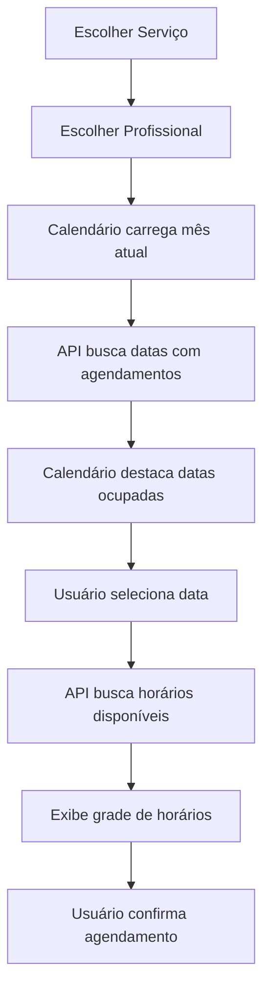

# 📅 Calendário Dinâmico de Agendamento

## ✨ Novidades Implementadas

### 🎯 Calendário Visual Interativo

Substituímos o input básico de data por um **calendário visual completo** com recursos avançados:

#### 🌟 Recursos Principais

1. **Navegação por Meses**
   - Botões para avançar/voltar meses
   - Botão "Hoje" para voltar rapidamente ao dia atual
   - Display do mês e ano atual

2. **Indicadores Visuais**
   - 🔵 **Data selecionada**: Destaque em azul primário
   - 🟣 **Datas com agendamentos**: Bordas roxas indicando dias ocupados
   - ⭕ **Dia atual**: Anel azul ao redor
   - 🔴 **Fins de semana**: Cor diferenciada (sábado e domingo)
   - ⚫ **Datas desabilitadas**: Cinza opaco

3. **Validações Automáticas**
   - Não permite selecionar datas passadas
   - Limite de 90 dias no futuro (configurável)
   - Destaca datas com agendamentos existentes
   - Mostra apenas dias disponíveis para agendamento

4. **Responsividade**
   - Grade 7x6 (semanas x dias)
   - Adapta-se a diferentes tamanhos de tela
   - Touch-friendly para dispositivos móveis

---

## 🔧 Arquivos Criados/Modificados

### 1. **`components/ui/calendar-picker.tsx`** (NOVO)
Componente reutilizável de calendário visual.

**Props:**
```typescript
interface CalendarPickerProps {
  selectedDate: string;           // Data selecionada (YYYY-MM-DD)
  onDateSelect: (date: string) => void;  // Callback ao selecionar
  minDate?: string;                // Data mínima permitida
  maxDate?: string;                // Data máxima permitida
  disabledDates?: string[];        // Array de datas desabilitadas
  highlightedDates?: string[];     // Datas com destaque (agendamentos)
  onMonthChange?: (month: string) => void; // Callback ao mudar mês
}
```

**Recursos:**
- Geração automática da grade do calendário
- Suporte a meses com 28-31 dias
- Preenchimento com dias do mês anterior/posterior
- Formatação automática de datas (YYYY-MM-DD)
- Validação de datas min/max
- Legenda visual explicativa

---

### 2. **`app/api/schedule/dates-with-bookings/route.ts`** (NOVO)
API para buscar datas com agendamentos existentes.

**Endpoint:** `GET /api/schedule/dates-with-bookings`

**Query Params:**
- `staffId`: ID do profissional
- `month`: Mês no formato YYYY-MM

**Resposta:**
```json
{
  "month": "2025-11",
  "staffId": "staff-1",
  "dates": [
    "2025-11-07",
    "2025-11-15",
    "2025-11-22"
  ],
  "count": 3
}
```

**Lógica:**
1. Busca agendamentos do profissional no mês especificado
2. Filtra apenas status PENDING e CONFIRMED (ignora cancelados)
3. Extrai datas únicas
4. Retorna array ordenado de datas

---

### 3. **`app/agendar-dinamico/page.tsx`** (MODIFICADO)
Página de agendamento atualizada com o novo calendário.

**Mudanças:**
- ✅ Removido input `<input type="date">`
- ✅ Adicionado componente `<CalendarPicker>`
- ✅ Estado `highlightedDates` para datas com agendamentos
- ✅ Estado `currentMonth` para controlar mês atual
- ✅ `useEffect` para buscar datas com agendamentos ao mudar mês
- ✅ Callback `onMonthChange` para atualizar destaques

---

## 🎨 Design & UX

### Railway Theme
O calendário segue o tema Railway do sistema:

- **Cores:**
  - Primário (azul): `hsl(260, 100%, 60%)`
  - Acento (roxo): `hsl(280, 100%, 70%)`
  - Sucesso (verde): `hsl(142, 71%, 45%)`

- **Efeitos:**
  - Glass morphism nos cards
  - Hover states suaves
  - Animações de transição
  - Shadow effects em elementos selecionados

### Acessibilidade
- ✅ Labels descritivos (aria-label)
- ✅ Botões desabilitados com cursor-not-allowed
- ✅ Alto contraste para leitura
- ✅ Indicadores visuais claros
- ✅ Navegação por teclado (Tab)

---

## 📊 Fluxo de Uso



---

## 🚀 Melhorias Implementadas

### Antes:
```html
<input type="date" min="2025-11-06" />
```
❌ Interface básica do navegador
❌ Sem indicação de datas ocupadas
❌ Experiência limitada

### Agora:
```tsx
<CalendarPicker
  selectedDate={date}
  onDateSelect={handleSelect}
  highlightedDates={busyDates}
  minDate={today}
/>
```
✅ Calendário visual completo
✅ Datas ocupadas destacadas
✅ Navegação intuitiva por meses
✅ Responsivo e acessível
✅ Validações automáticas

---

## 🧪 Como Testar

1. **Acesse:** `/agendar-dinamico`
2. **Escolha um serviço**
3. **Escolha um profissional**
4. **Observe o calendário:**
   - Datas com bordas roxas = dias com agendamentos
   - Anel azul = dia atual
   - Fundo azul = data selecionada
   - Cinza = datas passadas (desabilitadas)

5. **Navegue entre meses:**
   - Use os botões `< >` para mudar mês
   - Clique em "Hoje" para voltar ao dia atual
   - Observe os destaques atualizarem automaticamente

6. **Selecione uma data:**
   - Clique em um dia disponível
   - Veja os horários carregarem automaticamente
   - Grade de horários mostra apenas inícios válidos

---

## ⚙️ Configurações

### Limite de Dias no Futuro
Atualmente configurado para **90 dias**. Para alterar:

```tsx
// app/agendar-dinamico/page.tsx
maxDate={(() => {
  const max = new Date();
  max.setDate(max.getDate() + 90); // ← Altere aqui
  return max.toISOString().split("T")[0];
})()}
```

### Dias da Semana Desabilitados
Para desabilitar domingos ou outros dias:

```tsx
<CalendarPicker
  disabledDates={[
    "2025-11-09", // Domingo
    "2025-11-16", // Domingo
    // ...
  ]}
/>
```

### Cores e Estilos
Personalize em `components/ui/calendar-picker.tsx`:

```tsx
// Data selecionada
className="bg-primary text-white"

// Data destacada (com agendamentos)
className="bg-accent/20 border-accent/50"

// Dia atual
className="ring-2 ring-primary/50"
```

---

## 📱 Responsividade

### Desktop (≥1024px)
- Grade completa 7x7
- Botões grandes e espaçados
- Hover effects suaves

### Tablet (768px - 1023px)
- Grade ajustada
- Botões médios
- Touch otimizado

### Mobile (<768px)
- Grade compacta mas legível
- Botões touch-friendly (min 44x44px)
- Scroll vertical suave

---

## 🐛 Tratamento de Erros

1. **Mês inválido:**
   ```json
   { "error": "Formato de mês inválido. Use: YYYY-MM" }
   ```

2. **Profissional não encontrado:**
   - Retorna array vazio: `{ "dates": [] }`

3. **Erro de rede:**
   - Fallback: não destaca datas (continua funcional)

---

## 🎯 Próximos Passos

- [ ] Cache de datas com agendamentos (Redis)
- [ ] Indicador de ocupação (%, cor gradiente)
- [ ] Tooltip ao hover (ex: "3 agendamentos")
- [ ] Modo compacto (mês dropdown)
- [ ] Seleção de múltiplas datas (recorrência)
- [ ] Exportar para iCal/Google Calendar

---

## 📚 Dependências

- **React 18**: Hooks (useState, useEffect)
- **Lucide React**: Ícones (ChevronLeft, ChevronRight, Calendar)
- **Tailwind CSS**: Estilos utilitários
- **Next.js 14**: App Router, Server Components

---

## 🔗 Referências

- [Documentação CalendarPicker](../components/ui/calendar-picker.tsx)
- [API Dates with Bookings](../app/api/schedule/dates-with-bookings/route.ts)
- [Página Agendamento Dinâmico](../app/agendar-dinamico/page.tsx)

---

**Desenvolvido com 💜 para melhorar a experiência de agendamento**
