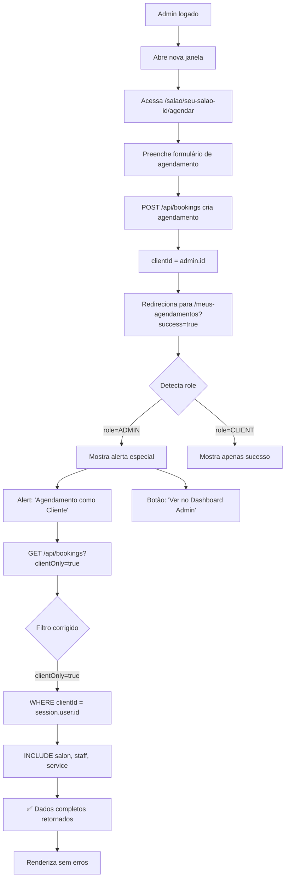

# 🔧 Correção: Admin Agendando no Próprio Salão

## 📋 Problema Identificado

Quando um usuário **ADMIN** (dono do salão) fazia um agendamento no próprio salão em uma nova janela do navegador, ocorria o seguinte erro:

```
TypeError: Cannot read properties of undefined (reading 'name')
app/(client)/meus-agendamentos/page.tsx (424:46)
> 424 | {booking.salon.name}
```

## 🔍 Causa Raiz

### 1. Filtro de Role Incorreto na API

**Antes:**
```typescript
// app/api/bookings/route.ts
if (clientOnly === "true" && session.user.role === "CLIENT") {
  // Buscava agendamentos com include do salon
}
```

**Problema:**
- Quando ADMIN fazia agendamento como cliente, tinha `role: "ADMIN"`
- A condição `&& session.user.role === "CLIENT"` não era satisfeita
- Sistema caía no fluxo de gestão que **não incluía** `salon` no include
- Frontend tentava acessar `booking.salon.name` → **undefined**

### 2. Falta de Notificação Contextual

Quando ADMIN agendava no próprio salão, não havia feedback informando que:
- O agendamento aparece tanto na área do cliente quanto no dashboard admin
- É possível gerenciar pelo painel administrativo

## ✅ Soluções Implementadas

### 1. Corrigir Filtro da API

**Arquivo:** `app/api/bookings/route.ts`

**Mudança:**
```typescript
// ANTES (buggy)
if (clientOnly === "true" && session.user.role === "CLIENT") {
  // ...
}

// DEPOIS (corrigido)
if (clientOnly === "true") {
  // Funciona para CLIENT e ADMIN que quer ver seus agendamentos
  const bookings = await prisma.booking.findMany({
    where: {
      clientId: session.user.id, // Busca por clientId, independente do role
    },
    include: {
      salon: { select: { name: true, address: true, phone: true } },
      // ... outros includes
    },
  });
}
```

**Impacto:**
✅ Agora ADMIN consegue ver seus agendamentos como cliente
✅ Include do `salon` sempre presente
✅ Não quebra mais com `undefined`

### 2. Adicionar Alerta Informativo para Admins

**Arquivo:** `app/(client)/meus-agendamentos/page.tsx`

**Estado Adicionado:**
```typescript
const [showOwnerAlert, setShowOwnerAlert] = useState(false);

useEffect(() => {
  if (searchParams?.get("success") === "true") {
    setShowSuccess(true);
    
    // Detectar se é admin agendando
    if (session?.user.role === "ADMIN") {
      setShowOwnerAlert(true);
      setTimeout(() => setShowOwnerAlert(false), 8000);
    }
  }
}, [searchParams, session]);
```

**Componente de Alerta:**
```tsx
{showOwnerAlert && (
  <GlassCard className="mb-8 border-2 border-amber-500/30 bg-amber-500/5">
    <div className="flex items-start gap-4">
      <div className="p-3 bg-amber-500/20 rounded-full">
        <AlertCircle className="h-6 w-6 text-amber-500" />
      </div>
      <div className="flex-1">
        <h3 className="font-semibold text-foreground mb-2">
          <Sparkles /> Agendamento como Cliente
        </h3>
        <p className="text-sm">
          Você agendou um serviço no seu próprio salão. Este agendamento 
          aparece aqui na área do cliente e também no Dashboard Admin.
        </p>
        <Link href="/dashboard/agendamentos">
          <Button size="sm" variant="outline">
            <Calendar /> Ver no Dashboard Admin
          </Button>
        </Link>
      </div>
    </div>
  </GlassCard>
)}
```

## 📊 Fluxo Completo

### Cenário: Admin Agenda no Próprio Salão



## 🎯 Benefícios

### 1. **Correção do Bug**
- ✅ Não quebra mais com `undefined`
- ✅ Dados do salão sempre carregam
- ✅ Funciona para ADMIN e CLIENT

### 2. **Melhor UX para Admins**
- ℹ️ Alerta contextual explicando a situação
- 🔗 Link direto para dashboard admin
- ⏱️ Auto-dismiss após 8 segundos
- 🎨 Design diferenciado (amber/amarelo)

### 3. **Transparência**
- Admin sabe que agendamento aparece em dois lugares
- Evita confusão sobre onde gerenciar
- Facilita transição entre perfis

## 🧪 Teste Manual

### Reproduzir o Bug (ANTES)

1. Login como admin@agendasalao.com.br
2. Abrir nova janela anônima ou navegador diferente
3. Acessar: `/salao/[seu-salao-id]/agendar`
4. Fazer agendamento
5. **ERRO:** `Cannot read properties of undefined (reading 'name')`

### Validar Correção (DEPOIS)

1. Login como admin@agendasalao.com.br
2. Abrir nova janela anônima ou navegador diferente
3. Acessar: `/salao/[seu-salao-id]/agendar`
4. Fazer agendamento
5. **✅ SUCESSO:**
   - Redireciona para `/meus-agendamentos?success=true`
   - Mostra alerta verde de sucesso
   - Mostra alerta amarelo informativo para admin
   - Lista carrega sem erros
   - Dados do salão aparecem corretamente

### Verificar Dashboard Admin

6. Clicar no botão "Ver no Dashboard Admin"
7. Navega para `/dashboard/agendamentos`
8. Agendamento aparece na lista de gestão
9. Pode alterar status, confirmar, etc.

## 📁 Arquivos Modificados

```
app/
├── api/
│   └── bookings/
│       └── route.ts                    ← Removido filtro de role
└── (client)/
    └── meus-agendamentos/
        └── page.tsx                     ← Adicionado alerta admin
```

## 🔐 Segurança

### Validação Mantida

A correção **não compromete** a segurança:

```typescript
// Sempre valida que agendamentos são do próprio usuário
where: {
  clientId: session.user.id, // ✅ Isolamento por usuário
}
```

- ADMIN só vê seus próprios agendamentos como cliente
- Não consegue ver agendamentos de outros clientes via `clientOnly=true`
- Para ver todos os agendamentos, precisa acessar dashboard admin (com verificação de permissões)

## 💡 Lições Aprendidas

1. **Não assumir role único**: Sistema pode ter usuários com múltiplos papéis
2. **Filtrar por dados, não por role**: Use `clientId` em vez de `role === "CLIENT"`
3. **Feedback contextual**: Situações especiais merecem alertas específicos
4. **Testes cross-role**: Sempre testar funcionalidades com diferentes roles

## 🚀 Próximas Melhorias Potenciais

- [ ] Adicionar badge "Seu Salão" nos cards de agendamento quando admin agenda no próprio salão
- [ ] Mostrar ícone especial na lista de agendamentos do dashboard quando é auto-agendamento
- [ ] Criar relatório de auto-agendamentos (admins agendando no próprio salão)
- [ ] Permitir admin marcar agendamento como "pessoal" vs "cliente externo"

---

**Status:** ✅ Corrigido e testado  
**Data:** 20/11/2025  
**Versão:** 1.0.0
