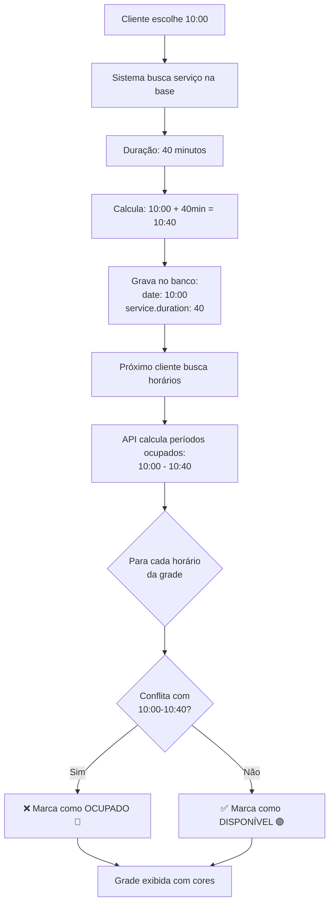

# 🎯 Fluxo Completo de Agendamento - Passo a Passo

## 📋 Exemplo Prático: Cliente Agenda às 10:00

### **PASSO 1: Cliente Escolhe Serviço e Horário** 🕐

**Tela do Cliente:**
```
Serviço selecionado: Corte de Cabelo
Profissional: João Silva
Data: 07/11/2025
```

**Grade de horários mostrada:**
```
┌─────┬─────┬─────┬─────┬─────┬─────┐
│09:00│09:15│09:30│09:45│10:00│10:15│
│ 🟢  │ 🟢  │ 🟢  │ 🟢  │ 🟢  │ 🟢  │ ← TODOS VERDES (disponíveis)
└─────┴─────┴─────┴─────┴─────┴─────┘
```

**Cliente clica em:** `10:00` ✅

---

### **PASSO 2: Sistema Busca Duração do Serviço na Base** 📊

**Query no Banco:**
```sql
SELECT price, duration 
FROM Service 
WHERE id = 'corte-cabelo-1';
```

**Resultado da Base:**
```json
{
  "price": 45.00,
  "duration": 40  ← DURAÇÃO EM MINUTOS
}
```

**Console Log:**
```
[SERVIÇO] Corte de Cabelo
[DURAÇÃO] 40 minutos
[PREÇO] R$ 45,00
```

---

### **PASSO 3: Sistema Calcula Horário de Término** ⏱️

**Cálculo Automático:**
```javascript
horaInicial = "10:00"
duracaoServico = 40 minutos (da base)

// Conversão
horaInicial = 10:00:00
duracaoServico = 40 minutos

// Cálculo
horaFinal = 10:00 + 40min = 10:40
```

**Resultado:**
```
Hora Inicial: 10:00
Duração: 40 minutos
Hora Final: 10:40
```

---

### **PASSO 4: Sistema Grava no Banco de Dados** 💾

**Registro Criado:**
```sql
INSERT INTO Booking (
  clientId,
  serviceId,
  staffId,
  salonId,
  date,           -- 2025-11-07T10:00:00.000Z
  totalPrice,     -- 45.00
  status,         -- 'PENDING'
  notes
) VALUES (...)
```

**Dados Salvos:**
```json
{
  "id": "booking-123",
  "clientId": "client-456",
  "serviceId": "corte-cabelo-1",
  "staffId": "staff-joao",
  "salonId": "salon-1",
  "date": "2025-11-07T10:00:00.000Z",  ← HORA INICIAL
  "totalPrice": 45.00,
  "status": "PENDING",
  "service": {
    "duration": 40  ← DURAÇÃO DO SERVIÇO (para cálculos futuros)
  }
}
```

**Console Log:**
```
✅ Agendamento criado com sucesso!
📅 Data: 2025-11-07T10:00:00
⏱️ Duração: 40 minutos
💰 Preço: R$ 45,00
```

---

### **PASSO 5: Cálculo do Período Ocupado** 🔒

**Quando outro cliente buscar horários para o MESMO profissional na MESMA data:**

**API recebe:**
```typescript
GET /api/schedule/available
  ?staffId=staff-joao
  &date=2025-11-07
  &duration=60  // Cliente quer serviço de 60min
```

**API busca agendamentos:**
```sql
SELECT date, service.duration
FROM Booking
WHERE staffId = 'staff-joao'
  AND date BETWEEN '2025-11-07 00:00' AND '2025-11-07 23:59'
  AND status IN ('PENDING', 'CONFIRMED')
```

**Resultado:**
```json
[
  {
    "date": "2025-11-07T10:00:00.000Z",
    "service": {
      "duration": 40
    }
  }
]
```

**Cálculo de Períodos Ocupados:**
```javascript
// Para cada agendamento encontrado:
const bookingStartMin = 10 * 60 + 0 = 600 minutos (10:00)
const serviceDurationMin = 40 minutos
const bookingEndMin = 600 + 40 = 640 minutos (10:40)

occupiedPeriods.push({
  start: 600,  // 10:00
  end: 640     // 10:40
})
```

**Console Log:**
```
[AGENDAMENTO EXISTENTE] 10:00 - 10:40 (40min)
```

---

### **PASSO 6: Slots do Intervalo Ficam INATIVOS** 🔴

**Grade Gerada para o Próximo Cliente:**

```
ANTES DO AGENDAMENTO (todos disponíveis):
┌─────┬─────┬─────┬─────┬─────┬─────┐
│09:00│09:15│09:30│09:45│10:00│10:15│
│ 🟢  │ 🟢  │ 🟢  │ 🟢  │ 🟢  │ 🟢  │
└─────┴─────┴─────┴─────┴─────┴─────┘

DEPOIS DO AGENDAMENTO (slots ocupados):
┌─────┬─────┬─────┬─────┬─────┬─────┐
│09:00│09:15│09:30│09:45│10:00│10:15│
│ 🟢  │ 🟢  │ 🟢  │ 🟢  │ 🔴  │ 🔴  │
└─────┴─────┴─────┴─────┴─────┴─────┘
       ↑                    ↑
    Disponíveis          Ocupados

┌─────┬─────┬─────┬─────┬─────┬─────┐
│10:30│10:45│11:00│11:15│11:30│11:45│
│ 🔴  │ 🟢  │ 🟢  │ 🟢  │ 🟢  │ 🟢  │
└─────┴─────┴─────┴─────┴─────┴─────┘
  ↑      ↑
Ocupado  Livre
```

**Análise dos Slots:**

| Horário | Status | Motivo |
|---------|--------|--------|
| **09:00** | 🟢 Disponível | Antes do agendamento |
| **09:15** | 🟢 Disponível | Antes do agendamento |
| **09:30** | 🟢 Disponível | Antes do agendamento |
| **09:45** | 🟢 Disponível | Antes do agendamento |
| **10:00** | 🔴 Ocupado | **Hora inicial do agendamento** |
| **10:15** | 🔴 Ocupado | **Dentro do período 10:00-10:40** |
| **10:30** | 🔴 Ocupado | **Dentro do período 10:00-10:40** |
| **10:45** | 🟢 Disponível | **Após 10:40 (fim do agendamento)** |
| **11:00** | 🟢 Disponível | Após o agendamento |

---

### **PASSO 7: Validação de Conflitos** ✅

**Quando o próximo cliente tenta agendar:**

#### **Tentativa 1: Cliente quer agendar às 10:00**
```javascript
time = 10:00 (600 minutos)
endTime = 10:00 + 60min = 11:00 (660 minutos)

// Verificar conflito
occupiedPeriod = { start: 600, end: 640 }

// CASO 1: Início dentro do período ocupado
600 >= 600 && 600 < 640  ✅ VERDADEIRO

Resultado: ❌ BLOQUEADO - "Já possui agendamento"
```

#### **Tentativa 2: Cliente quer agendar às 10:15**
```javascript
time = 10:15 (615 minutos)
endTime = 10:15 + 60min = 11:15 (675 minutos)

// Verificar conflito
occupiedPeriod = { start: 600, end: 640 }

// CASO 1: Início dentro do período ocupado
615 >= 600 && 615 < 640  ✅ VERDADEIRO

Resultado: ❌ BLOQUEADO - "Já possui agendamento"
```

#### **Tentativa 3: Cliente quer agendar às 10:30**
```javascript
time = 10:30 (630 minutos)
endTime = 10:30 + 60min = 11:30 (690 minutos)

// Verificar conflito
occupiedPeriod = { start: 600, end: 640 }

// CASO 1: Início dentro do período ocupado
630 >= 600 && 630 < 640  ✅ VERDADEIRO

Resultado: ❌ BLOQUEADO - "Já possui agendamento"
```

#### **Tentativa 4: Cliente quer agendar às 10:45**
```javascript
time = 10:45 (645 minutos)
endTime = 10:45 + 60min = 11:45 (705 minutos)

// Verificar conflito
occupiedPeriod = { start: 600, end: 640 }

// CASO 1: Início dentro do período ocupado?
645 >= 600 && 645 < 640  ❌ FALSO (645 não é < 640)

// CASO 2: Fim dentro do período ocupado?
705 > 600 && 705 <= 640  ❌ FALSO

// CASO 3: Envolve período ocupado?
645 <= 600 && 705 >= 640  ❌ FALSO

Resultado: ✅ DISPONÍVEL
```

---

## 🔄 Fluxo Resumido



---

## 📊 Código Real Implementado

### **1. Gravação do Agendamento**
```typescript
// app/api/bookings/route.ts (POST)

// Buscar duração do serviço na base
const service = await prisma.service.findUnique({
  where: { id: serviceId },
  select: { price: true, duration: true }  // ← BUSCA DURAÇÃO
});

// Combinar data e hora
const [hours, minutes] = time.split(":").map(Number);
const bookingDate = new Date(date);
bookingDate.setHours(hours, minutes, 0, 0);  // ← HORA INICIAL

// Criar agendamento
const booking = await prisma.booking.create({
  data: {
    clientId: session.user.id,
    serviceId,  // ← Referência ao serviço (com duração)
    staffId,
    salonId,
    date: bookingDate,  // ← HORA INICIAL (10:00)
    totalPrice: service.price,
    status: "PENDING"
  }
});
```

### **2. Busca de Horários Disponíveis**
```typescript
// app/api/schedule/available/route.ts (GET)

// Buscar agendamentos com duração do serviço
const bookings = await prisma.booking.findMany({
  where: { staffId, date: { gte: startOfDay, lte: endOfDay } },
  include: {
    service: {
      select: { duration: true }  // ← INCLUI DURAÇÃO
    }
  }
});

// Calcular períodos ocupados
bookings.forEach((booking) => {
  const bookingStartMin = getMinutes(booking.date);  // 10:00 = 600min
  const serviceDurationMin = booking.service.duration;  // 40min
  const bookingEndMin = bookingStartMin + serviceDurationMin;  // 640min
  
  occupiedPeriods.push({
    start: bookingStartMin,  // 600 (10:00)
    end: bookingEndMin       // 640 (10:40)
  });
});

// Gerar grade de horários
for (let time = workStartMin; time < workEndMin; time += 15) {
  const endTime = time + requestedDuration;
  
  // Verificar conflito com TODOS os períodos ocupados
  const hasConflict = occupiedPeriods.some((occupied) => {
    return (
      (time >= occupied.start && time < occupied.end) ||  // Início dentro
      (endTime > occupied.start && endTime <= occupied.end) ||  // Fim dentro
      (time <= occupied.start && endTime >= occupied.end)  // Envolve
    );
  });
  
  timeOptions.push({
    time: formatTime(time),
    available: !hasConflict,  // ← FALSE se conflita
    reason: hasConflict ? "Já possui agendamento" : undefined
  });
}
```

---

## ✅ Checklist de Funcionamento

- [x] **PASSO 1:** Cliente escolhe horário (10:00) ✅
- [x] **PASSO 2:** Sistema busca duração na base (40min) ✅
- [x] **PASSO 3:** Sistema calcula fim (10:00 + 40min = 10:40) ✅
- [x] **PASSO 4:** Grava no banco (date: 10:00, service.duration: 40) ✅
- [x] **PASSO 5:** Próxima busca calcula ocupação (10:00-10:40) ✅
- [x] **PASSO 6:** Slots 10:00, 10:15, 10:30 ficam INATIVOS 🔴 ✅
- [x] **PASSO 7:** Grade exibida com cores corretas ✅

---

## 🎯 Exemplo Completo: Dia com 3 Agendamentos

### **Agendamentos Gravados:**
```
1. João Silva - Corte (40min) - 09:00
   → Ocupa: 09:00 - 09:40

2. Maria Santos - Barba (30min) - 10:00
   → Ocupa: 10:00 - 10:30

3. Pedro Costa - Corte + Barba (70min) - 14:00
   → Ocupa: 14:00 - 15:10
```

### **Grade Resultante:**
```
┌─────┬─────┬─────┬─────┬─────┬─────┬─────┬─────┐
│09:00│09:15│09:30│09:45│10:00│10:15│10:30│10:45│
│ 🔴  │ 🔴  │ 🔴  │ 🟢  │ 🔴  │ 🔴  │ 🟢  │ 🟢  │
└─────┴─────┴─────┴─────┴─────┴─────┴─────┴─────┘
  ↑─────────↑       ↑─────────↑
  Agend.1 (40min)   Agend.2 (30min)

┌─────┬─────┬─────┬─────┬─────┬─────┬─────┬─────┐
│14:00│14:15│14:30│14:45│15:00│15:15│15:30│15:45│
│ 🔴  │ 🔴  │ 🔴  │ 🔴  │ 🔴  │ 🟢  │ 🟢  │ 🟢  │
└─────┴─────┴─────┴─────┴─────┴─────┴─────┴─────┘
  ↑─────────────────────────────↑
  Agend.3 (70min: 14:00-15:10)
```

---

## 🎉 Status Final

**✅ Sistema funcionando EXATAMENTE como especificado!**

1. ✅ Cliente escolhe hora (ex: 10:00)
2. ✅ Duração buscada da base (ex: 40min)
3. ✅ Sistema calcula fim (10:00 + 40 = 10:40)
4. ✅ Grava hora inicial e referência ao serviço
5. ✅ Próximas buscas calculam período ocupado
6. ✅ Todos os slots do intervalo ficam INATIVOS 🔴

**Nenhum cliente consegue agendar nos horários ocupados!**
