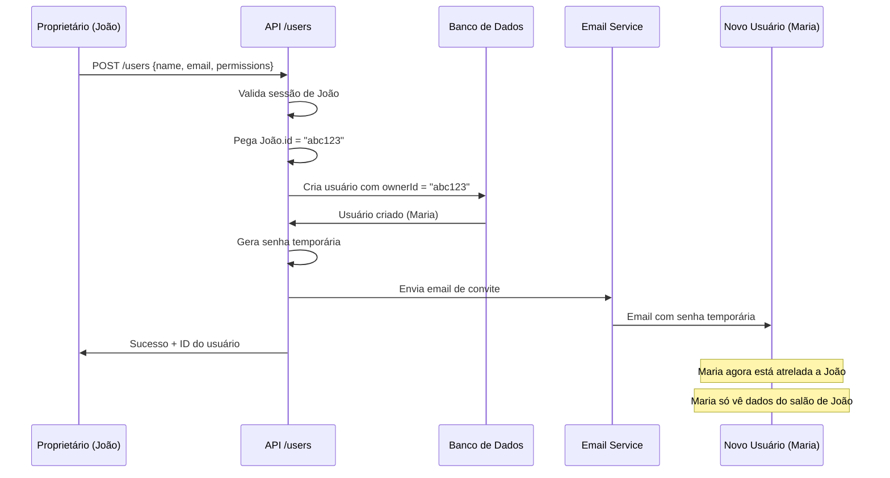

# Sistema de Hierarquia de Usuários (Multi-Tenant)

## 🏢 Estrutura de Relacionamento

### Visão Geral

Cada usuário criado é **completamente atrelado** ao proprietário que o criou. Este sistema garante:
- ✅ Isolamento de dados entre diferentes salões
- ✅ Proprietário só vê seus próprios usuários
- ✅ Controle total sobre usuários gerenciados
- ✅ Segurança e privacidade

## 📊 Hierarquia no Banco de Dados

```
┌─────────────────────────────────────────┐
│  PROPRIETÁRIO (OWNER)                   │
│  João Silva                             │
│  ID: abc123                             │
│  role: ADMIN                            │
│  roleType: OWNER                        │
│  ownerId: null                          │
│  Salão: "Salão Beleza Total"          │
└─────────────────────────────────────────┘
           │
           ├──────────────┬──────────────┬───────────────┐
           │              │              │               │
           ▼              ▼              ▼               ▼
    ┌───────────┐   ┌───────────┐   ┌───────────┐   ┌───────────┐
    │  STAFF    │   │  CUSTOM   │   │  CUSTOM   │   │  CUSTOM   │
    │  Maria    │   │  Pedro    │   │  Ana      │   │  Carlos   │
    │  abc123   │   │  abc123   │   │  abc123   │   │  abc123   │
    └───────────┘   └───────────┘   └───────────┘   └───────────┘
    Recepcionista   Caixa         Gerente Ops    Apenas Leitura
```

## 🔗 Campos do Schema

### Campos Importantes no Model User:

```prisma
model User {
  id              String   @id
  name            String
  email           String   @unique
  role            String   // "CLIENT" ou "ADMIN"
  roleType        String?  // "OWNER", "STAFF", "CUSTOM"
  ownerId         String?  // 👈 CAMPO CHAVE - ID do proprietário
  permissions     String[] // Array de permissões
  
  // Relações
  owner           User?    @relation("UserOwner", fields: [ownerId], references: [id])
  managedUsers    User[]   @relation("UserOwner")
}
```

### Significado dos Campos:

| Campo | Descrição | Exemplo |
|-------|-----------|---------|
| `ownerId` | ID do proprietário que criou este usuário | `"abc123"` |
| `role` | Papel no sistema | `"ADMIN"` (acessa dashboard) ou `"CLIENT"` |
| `roleType` | Tipo específico | `"OWNER"` (dono), `"STAFF"` (funcionário), `"CUSTOM"` (personalizado) |

## 🔒 Como Funciona o Isolamento

### 1. Criação de Usuário

```typescript
// API: POST /api/users
const newUser = await prisma.user.create({
  data: {
    name: "Maria Silva",
    email: "maria@exemplo.com",
    ownerId: currentUser.id,  // 👈 ATRELADO ao proprietário logado
    roleType: "STAFF",
    permissions: ["bookings.view", "services.view"]
  }
})
```

**Resultado:**
- Maria só pode ser gerenciada por João
- Maria só vê dados do salão de João
- Maria não vê usuários de outros salões

### 2. Listagem de Usuários

```typescript
// API: GET /api/users
const users = await prisma.user.findMany({
  where: {
    ownerId: currentUser.id  // 👈 FILTRA automaticamente
  }
})
```

**Resultado:**
- João vê apenas: Maria, Pedro, Ana, Carlos (seus usuários)
- João NÃO vê usuários de outros proprietários

### 3. Edição de Usuário

```typescript
// API: PUT /api/users/[id]
// Verifica se o usuário pertence ao proprietário logado
const userToUpdate = await prisma.user.findFirst({
  where: {
    id: userId,
    ownerId: currentUser.id  // 👈 VALIDA propriedade
  }
})

if (!userToUpdate) {
  throw new Error("Usuário não encontrado ou sem permissão")
}
```

**Resultado:**
- João só pode editar seus próprios usuários
- Tentativa de editar usuário de outro salão = erro 403

## 🎯 Cenários Práticos

### Cenário 1: Dois Salões Independentes

```
Salão A (João - abc123)          Salão B (Carlos - def456)
├── Maria (ownerId: abc123)      ├── Paula (ownerId: def456)
├── Pedro (ownerId: abc123)      ├── Rafael (ownerId: def456)
└── Ana   (ownerId: abc123)      └── Lucia  (ownerId: def456)

❌ João NÃO vê nem pode editar usuários de Carlos
❌ Carlos NÃO vê nem pode editar usuários de João
```

### Cenário 2: Tentativa de Acesso Indevido

```
1. João está logado (ID: abc123)
2. João tenta acessar /api/users/xyz999 (usuário de outro salão)
3. Sistema verifica: xyz999.ownerId !== abc123
4. Retorna: 403 Forbidden
```

### Cenário 3: Herança de Salão

```
Proprietário João (abc123)
├── Salão: "Beleza Total" (ownerId: abc123)
│   ├── Profissionais do salão
│   ├── Serviços do salão
│   └── Agendamentos do salão
│
└── Usuários Gerenciados (ownerId: abc123)
    ├── Maria (acessa dados do "Beleza Total")
    ├── Pedro (acessa dados do "Beleza Total")
    └── Ana   (acessa dados do "Beleza Total")

Todos os usuários veem APENAS dados do salão de João
```

## 🛡️ Camadas de Segurança

### 1. Nível de Banco de Dados
```sql
-- Sempre filtra por ownerId
SELECT * FROM "User" WHERE "ownerId" = 'abc123';
```

### 2. Nível de API
```typescript
// Verifica em TODA requisição
const currentUser = await getCurrentUser()
const allowed = resource.ownerId === currentUser.id
```

### 3. Nível de UI
```typescript
// Sidebar mostra apenas dados do proprietário logado
const users = await fetch("/api/users") // Já vem filtrado
```

### 4. Nível de Sessão
```typescript
// Token JWT contém ID do usuário
// Sistema valida em cada request
```

## 📋 Tabela de Permissões vs Hierarquia

| Usuário | Role | RoleType | ownerId | Pode Gerenciar Usuários | Vê Dados de |
|---------|------|----------|---------|-------------------------|-------------|
| João | ADMIN | OWNER | null | ✅ Sim (seus usuários) | Seu salão |
| Maria | CLIENT | STAFF | abc123 | ❌ Não | Salão de João |
| Pedro | CLIENT | CUSTOM | abc123 | ❌ Não | Salão de João |
| Carlos | ADMIN | OWNER | null | ✅ Sim (seus usuários) | Seu salão |
| Paula | CLIENT | STAFF | def456 | ❌ Não | Salão de Carlos |

## 🔄 Fluxo Completo de Criação



## ✅ Vantagens do Sistema

1. **Isolamento Total**
   - Dados de um salão não vazam para outro
   - Cada proprietário é um "mundo" independente

2. **Segurança**
   - Impossível acessar dados de outros salões
   - Validação em múltiplas camadas

3. **Escalabilidade**
   - Sistema suporta milhares de salões
   - Performance mantida com índices no banco

4. **Facilidade de Gestão**
   - Proprietário controla tudo sobre seus usuários
   - Interface simples e intuitiva

5. **Conformidade LGPD**
   - Dados isolados por proprietário
   - Fácil deletar dados de um salão específico

## 🚀 Exemplo Real

```typescript
// João faz login
login("joao@salao.com", "senha123")

// João cria usuário
POST /api/users
{
  name: "Maria Silva",
  email: "maria@exemplo.com",
  permissions: ["bookings.view", "services.view"]
}

// Sistema automaticamente:
✅ Define ownerId = "abc123" (ID de João)
✅ Envia email de convite para Maria
✅ Maria recebe senha temporária
✅ Maria faz primeiro login
✅ Maria vê apenas dashboard com Agendamentos e Serviços
✅ Maria vê apenas dados do salão de João

// Tentativa de acesso indevido:
Maria tenta acessar /api/staff?salonId=xyz999 (outro salão)
❌ Sistema bloqueia: salon.ownerId !== maria.ownerId
```

## 📝 Resumo Técnico

**Sim, o usuário criado fica TOTALMENTE atrelado às credenciais do proprietário que o criou.**

**Como:**
- Campo `ownerId` no banco de dados
- Todas as queries filtram por `ownerId`
- APIs validam propriedade em cada request
- UI mostra apenas dados do proprietário logado

**Resultado:**
- Isolamento completo entre salões
- Segurança garantida em todas as camadas
- Experiência multi-tenant perfeita
