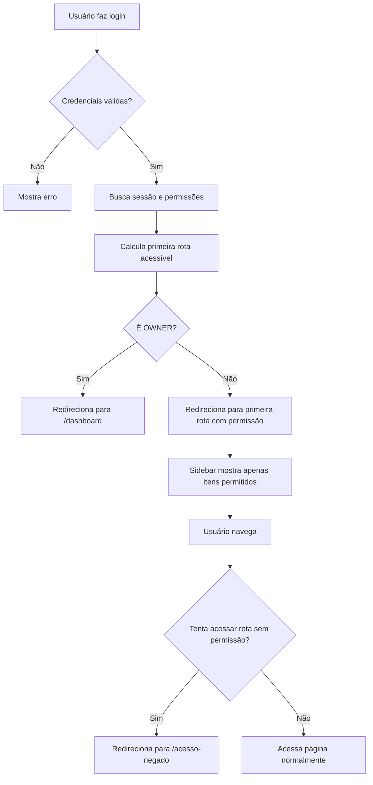

# Sistema de Navegação Baseado em Permissões

## Visão Geral

Este sistema garante que cada usuário veja **apenas as páginas e funcionalidades** às quais tem permissão de acesso, criando uma experiência personalizada e segura.

## Como Funciona

### 1. **Login Inteligente**

Quando um usuário faz login, o sistema:
- ✅ Valida as credenciais
- ✅ Busca as permissões do usuário
- ✅ Redireciona para a **primeira página acessível**

**Exemplo:**
```
Usuário com permissões: ["bookings.view", "services.view"]
→ Será redirecionado para: /dashboard/agendamentos
```

### 2. **Sidebar Filtrada**

A barra lateral mostra **apenas os itens** que o usuário tem permissão:

| Permissão | Item do Menu |
|-----------|--------------|
| `dashboard.view` | Dashboard |
| `salon.view` | Meu Salão |
| `bookings.view` | Agendamentos |
| `staff.view` | Profissionais |
| `services.view` | Serviços |
| `cashier.view` | Caixa |
| `expenses.view` | Contas a Pagar |
| `financial.view` | Análise Financeira |
| `users.view` | Usuários |
| `settings.view` | Configurações |

**Exemplo visual:**

```
👤 Usuário OWNER (tem todas as permissões)
├── 📊 Dashboard
├── 🏪 Meu Salão
├── 📅 Agendamentos
├── 👥 Profissionais
├── ✂️ Serviços
├── 💰 Caixa
├── 🧾 Contas a Pagar
├── 📈 Análise Financeira
├── 👤 Usuários
├── 💳 Assinatura
└── ⚙️ Configurações

👤 Usuário STAFF (permissões limitadas: bookings, services)
├── 📅 Agendamentos
├── ✂️ Serviços
└── 💳 Assinatura  (sem permissão requerida)
```

### 3. **Proteção de Rotas**

Tentativas de acessar páginas sem permissão resultam em:
- 🚫 Redirecionamento para `/dashboard/acesso-negado`
- 📝 Log de tentativa no console (para auditoria)

## Implementação

### Arquivos Criados

#### 1. `lib/navigation-helper.ts`
Funções utilitárias para navegação:
- `getFirstAccessibleRoute()` - Retorna primeira rota acessível
- `hasRouteAccess()` - Verifica se usuário pode acessar rota
- `NAVIGATION_ROUTES` - Mapeamento de rotas e permissões

#### 2. `components/auth/route-guard.tsx`
Componente para proteger páginas:
```tsx
<RouteGuard requiredPermission="bookings.view">
  <PáginaAgendamentos />
</RouteGuard>
```

#### 3. `app/(admin)/dashboard/acesso-negado/page.tsx`
Página de erro quando usuário não tem acesso

### Melhorias na Sidebar

A sidebar (`components/layout/sidebar.tsx`) já estava preparada e agora funciona perfeitamente:
- ✅ Filtra itens baseado em permissões
- ✅ Usa hook `usePermissions()`
- ✅ OWNER vê todos os itens

### Login Melhorado

A página de login (`app/(marketing)/login/page.tsx`) agora:
- ✅ Busca permissões após autenticação
- ✅ Calcula primeira rota acessível
- ✅ Redireciona usuário corretamente
- ✅ Loga informações para debug

## Fluxo Completo



## Exemplos de Uso

### Exemplo 1: Usuário de Caixa

**Permissões:**
```json
["cashier.view", "bookings.view"]
```

**Experiência:**
- Login → Redirecionado para `/dashboard/caixa`
- Vê no menu: Caixa, Agendamentos, Assinatura
- Não vê: Dashboard, Profissionais, Serviços, Financeiro, etc.

### Exemplo 2: Gerente de Agendamentos

**Permissões:**
```json
["dashboard.view", "bookings.view", "bookings.create", "bookings.edit", "services.view", "staff.view"]
```

**Experiência:**
- Login → Redirecionado para `/dashboard`
- Vê no menu: Dashboard, Agendamentos, Profissionais, Serviços, Assinatura
- Não vê: Caixa, Contas a Pagar, Financeiro, Usuários

### Exemplo 3: Proprietário (OWNER)

**RoleType:** `OWNER`

**Experiência:**
- Login → Redirecionado para `/dashboard`
- Vê TODOS os itens do menu
- Acesso completo a todas as páginas

## Como Adicionar Nova Rota Protegida

### 1. Adicionar no `navigation-helper.ts`

```typescript
export const NAVIGATION_ROUTES = [
  // ... rotas existentes
  {
    label: "Nova Funcionalidade",
    href: "/dashboard/nova-funcionalidade",
    permission: "nova.view",
  },
]
```

### 2. Adicionar na Sidebar

```typescript
const menuItems: MenuItem[] = [
  // ... itens existentes
  {
    label: "Nova Funcionalidade",
    icon: IconeNovo,
    href: "/dashboard/nova-funcionalidade",
    permission: "nova.view",
  },
]
```

### 3. Proteger a Página (Opcional)

```tsx
// app/(admin)/dashboard/nova-funcionalidade/page.tsx
import { RouteGuard } from "@/components/auth/route-guard"

export default function NovaFuncionalidadePage() {
  return (
    <RouteGuard requiredPermission="nova.view">
      <div>Conteúdo da página...</div>
    </RouteGuard>
  )
}
```

### 4. Adicionar Permissão no `lib/permissions.ts`

```typescript
export const PERMISSION_GROUPS = [
  // ... grupos existentes
  {
    name: "Nova Funcionalidade",
    permissions: [
      { key: "nova.view", label: "Visualizar nova funcionalidade" },
      { key: "nova.create", label: "Criar nova funcionalidade" },
      // ...
    ],
  },
]
```

## Testando

### 1. Criar usuário de teste

```
Nome: João Teste
Email: joao@teste.com
Permissões: ["bookings.view", "services.view"]
```

### 2. Fazer login

```
→ Deve redirecionar para /dashboard/agendamentos (primeira rota com permissão)
```

### 3. Verificar sidebar

```
✅ Deve ver: Agendamentos, Serviços, Assinatura
❌ Não deve ver: Dashboard, Profissionais, Caixa, etc.
```

### 4. Tentar acessar rota sem permissão

```
Digitar manualmente: /dashboard/financeiro
→ Deve redirecionar para /dashboard/acesso-negado
```

## Segurança

✅ **Client-side:** Sidebar filtrada, componente RouteGuard
✅ **Server-side:** Middleware verifica token JWT
✅ **API:** Cada endpoint valida permissões do usuário
✅ **Auditoria:** Logs de tentativas de acesso negado

## Vantagens

1. **Experiência Personalizada** - Cada usuário vê apenas o que pode acessar
2. **Segurança** - Múltiplas camadas de proteção
3. **Manutenibilidade** - Fácil adicionar novas rotas e permissões
4. **Escalabilidade** - Suporta hierarquias complexas de permissões
5. **UX Melhorada** - Usuário não se perde em menus irrelevantes

## Próximos Passos Sugeridos

- [ ] Adicionar cache de permissões para melhor performance
- [ ] Implementar auditoria completa de acessos
- [ ] Criar painel de gestão de roles pré-definidos
- [ ] Adicionar permissões temporárias (expiram em X dias)
- [ ] Sistema de solicitação de permissões pelo usuário
